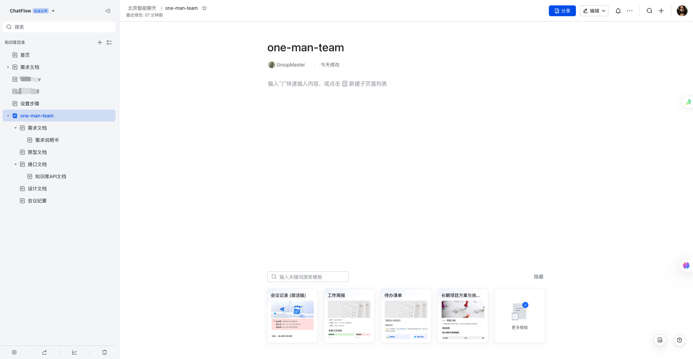

# OMT - OneManTeam CLI Tool

OMT 是一个用于管理文档知识库的命令行工具。它可以帮助你管理产品文档知识库，快速和你的开发项目进行知识共享。

## 快速入门

1. 安装omt cli工具

```bash
pip install one-man-team
```

2. 设置飞书应用凭证  

```bash
omt config set --app-id YOUR_APP_ID --app-secret YOUR_APP_SECRET --app-token YOUR_APP_TOKEN
```

3. 运行`omt project init my-project`，就可以在知识库中创建一个项目文档，然后你可以在飞书知识库中创建，进行知识共享。



4. 运行`omt project clone my-project`，就可以将你项目文档克隆到本地，之后就可以使用cursor愉快进行项目开发。


## 安装

1. 克隆仓库：
```bash
git clone <repository-url>
cd <repository-directory>
```

2. 安装依赖：
```bash
pip install -e .
```

## 快速开始

1. 设置配置：
```bash
# 设置应用凭证
omt config set --app-id YOUR_APP_ID --app-secret YOUR_APP_SECRET --app-token YOUR_APP_TOKEN

# 验证配置
omt config get
```

2. 创建项目：
```bash
# 创建新项目
omt project init my-project

# 创建项目并关联知识库
omt project init my-project --space-name "My Project Space"
```

## 命令参考

### 配置命令 (config)
```bash
# 完整形式
omt config set --app-id YOUR_APP_ID --app-secret YOUR_APP_SECRET --app-token YOUR_APP_TOKEN --output-format yaml

# 简写形式
omt config set -i YOUR_APP_ID -s YOUR_APP_SECRET -t YOUR_APP_TOKEN -o yaml

# 查看配置
omt config get

# 设置默认空间（完整形式）
omt config set --default-space SPACE_NAME

# 设置默认空间（简写形式）
omt config set -d SPACE_NAME
```

### 项目命令 (project)
```bash
# 初始化项目（完整形式）
omt project init PROJECT_NAME --space-name SPACE_NAME

# 初始化项目（简写形式）
omt project init PROJECT_NAME -s SPACE_NAME

# 克隆项目（完整形式）
omt project clone PROJECT_NAME --space-name SPACE_NAME [--force]

# 克隆项目（简写形式）
omt project clone PROJECT_NAME -s SPACE_NAME [-f]
```

### 知识库命令 (space)
```bash
# 列出知识库（完整形式）
omt space list --page-size 20 --lang zh

# 列出知识库（简写形式）
omt space list -p 20 -l zh

# 获取知识库信息
omt space get                       # 使用默认空间
omt space get SPACE_NAME           # 指定空间名称

# 创建知识库
omt space create SPACE_NAME

# 列出知识库节点（完整形式）
omt space nodes SPACE_NAME --parent-token TOKEN

# 列出知识库节点（简写形式）
omt space nodes SPACE_NAME -p TOKEN

# 获取知识库拓扑
omt space topology SPACE_NAME

# 获取节点信息
omt space node SPACE_NAME NODE_NAME

# 创建节点（完整形式）
omt space create-node SPACE_NAME NODE_TITLE --node-type origin --obj-type docx

# 创建节点（简写形式）
omt space create-node SPACE_NAME NODE_TITLE -t origin -o docx

# 获取节点内容（完整形式）
omt space content SPACE_NAME NODE_NAME --format markdown

# 获取节点内容（简写形式）
omt space content SPACE_NAME NODE_NAME -f markdown

# 列出知识库节点
omt space nodes                     # 使用默认空间
omt space nodes SPACE_NAME          # 指定空间名称
omt space nodes -p PARENT_TOKEN     # 列出指定父节点下的节点

# 获取知识库信息
omt space get                       # 使用默认空间
omt space get SPACE_NAME           # 指定空间名称

# 获取节点内容
omt space content NODE_NAME         # 使用默认空间
omt space content SPACE_NAME NODE_NAME  # 指定空间名称
```

### 节点命令 (node)
```bash
# 获取节点信息
omt node info OBJ_TOKEN

# 获取节点内容（完整形式）
omt node content OBJ_TOKEN --format markdown

# 获取节点内容（简写形式）
omt node content OBJ_TOKEN -f markdown

# 获取原始内容
omt node content OBJ_TOKEN --format raw
```

### 命令补全
```bash
# 安装补全脚本
omt completion install --shell bash  # 完整形式
omt completion install -s bash      # 简写形式

# 查看补全脚本
omt completion show [--shell bash|zsh|fish]
```

## 项目结构模板

当使用 `omt project init` 创建项目时，会创建以下标准结构：

```
PROJECT_NAME/
├── 需求文档/
│   └── 需求规格说明书
├── 原型文档/
├── 接口文档/
│   ├── 资源池API文档
│   └── 分布式训练任务API文档
└── 设计文档/
```

## 环境变量

工具会按以下优先级查找配置：

1. 项目目录下的 `.env` 文件
2. 用户目录下的 `~/.omt/.env` 文件

主要的环境变量：
- `app_id`: 飞书应用 ID
- `app_secret`: 飞书应用密钥
- `app_token`: 飞书应用令牌
- `output_format`: 输出格式（yaml/json，默认：yaml）
- `default_space`: 默认知识库名称

## 命令补全

OMT 支持命令行补全功能。

### 安装补全脚本

```bash
# 安装 Bash 补全
omt completion install

# 或者手动安装（Bash）
omt completion show >> ~/.bashrc
source ~/.bashrc
```

## 注意事项

1. 请妥善保管应用凭证，不要将其提交到版本控制系统
2. 建议使用项目级的 `.env` 文件来存储项目特定的配置
3. 部分操作可能需要较长时间，请耐心等待
4. 创建节点时的类型说明：
   - node_type: 通常使用 "origin"
   - obj_type: 可以是 "docx"（文档）等

## 常见问题

1. 配置文件找不到
   - 确保已运行 `omt config set` 设置配置
   - 检查 `~/.omt/.env` 文件是否存在

2. 权限不足
   - 确保应用具有足够的权限
   - 检查应用凭证是否正确

3. 命令格式错误
   - 不要重复输入 `omt`
   - 确保按照文档中的命令格式使用

## 贡献

欢迎提交 Issue 和 Pull Request！

## 许可证

[MIT License](LICENSE)

## 参数简写对照表

| 命令组    | 完整参数        | 简写参数 | 说明                    |
|-----------|----------------|----------|------------------------|
| config    | --app-id       | -i       | 飞书应用 ID            |
|           | --app-secret   | -s       | 飞书应用密钥           |
|           | --app-token    | -t       | 飞书应用令牌           |
|           | --output-format| -o       | 输出格式               |
|           | --default-space| -d       | 默认知识库             |
| space     | --page-size    | -p       | 每页显示数量           |
|           | --lang         | -l       | 语言                   |
|           | --parent-token | -p       | 父节点 Token           |
|           | --node-type    | -t       | 节点类型               |
|           | --obj-type     | -o       | 对象类型               |
|           | --format       | -f       | 内容格式               |
| project   | --space-name   | -s       | 知识库名称             |
| completion| --shell        | --shell  | Shell 类型             |
| node      | --format       | -f       | 内容格式               |
